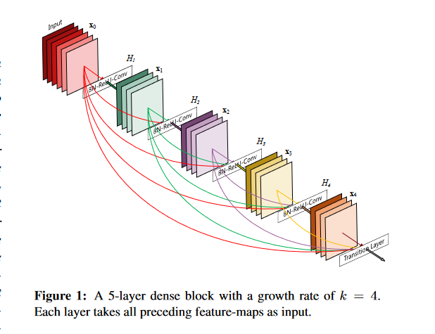

# DenseNet (Densely Connected Convolutional Networks)

    DenseNet, short for Densely Connected Convolutional Networks, is a type of convolutional neural network architecture introduced by Gao Huang, Zhuang Liu, Laurens van der Maaten, and Kilian Q. Weinberger in 2016. DenseNet distinguishes itself through its unique connectivity pattern: each layer in a dense block receives input from all preceding layers and passes its output to all subsequent layers.
# Key Features of DenseNet:

    Dense Connections: Each layer is directly connected to every other layer within a dense block, enhancing information and gradient flow throughout the network.
    Efficient Parameter Usage: By leveraging dense connections, DenseNet requires fewer parameters compared to traditional convolutional networks, often achieving better performance with a more compact model.
    Improved Gradient Flow: The dense connections help mitigate the vanishing gradient problem, making it easier to train deeper networks.
    Compact Architecture: DenseNet achieves high accuracy while maintaining a relatively small number of parameters, making it an efficient choice for various applications.

# Advantages:

    Enhanced Feature Reuse: The dense connectivity allows features from earlier layers to be reused by later layers, leading to more diverse and informative feature representations.
    Reduced Parameter Count: By reusing features, DenseNet significantly reduces the number of parameters, making it more memory-efficient.
    Ease of Training: The improved gradient flow facilitates the training of deeper networks, leading to potentially better performance on complex tasks.
