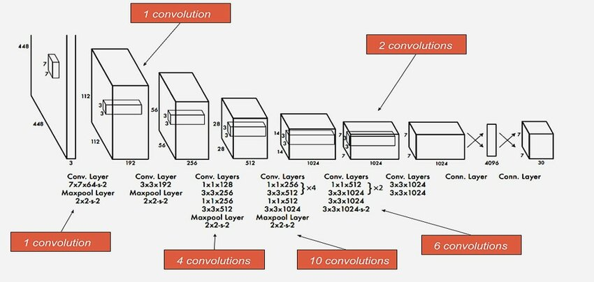

# YOLO v1 (You Only Look Once)

YOLO is a state-of-the-art real-time object detection system that processes images in one pass, directly predicting bounding boxes and class probabilities for each region. YOLO v1 was the first iteration of the YOLO model, focusing on speed and accuracy in object detection tasks.
Main Concepts

# 1. Single Network Architecture

YOLO v1 uses a single convolutional neural network (CNN) to predict bounding boxes and class probabilities simultaneously. It divides the input image into a grid and predicts bounding boxes and probabilities within each grid cell.

# 2. Grid and Cells

Grid: YOLO divides the input image into an S × S grid.
Cells: Each grid cell predicts multiple bounding boxes (B) and their confidence scores.

# 3. Predictions

Each grid cell predicts:
B bounding boxes: Each box characterized by 5 parameters (x, y, w, h, confidence).
Class probabilities: Conditional probabilities for each class.

# 4. Loss Function

YOLO v1 optimizes a combination of localization error (bounding box coordinates) and classification error (objectness score and class predictions) using a multi-part loss function.

# 5. Non-Max Suppression (NMS)

After prediction, YOLO applies NMS to suppress multiple overlapping bounding boxes, retaining only the most confident ones.

# 6. Training

Dataset: YOLO v1 typically trains on large datasets like COCO or Pascal VOC, annotated with object bounding boxes.
Augmentation: Training images are augmented to increase diversity and improve generalization.

# 7. Performance

YOLO v1 balances speed and accuracy, achieving real-time object detection on standard hardware.

# 7. Recap Images

.png>)

.png>)

.png>)

.png>)

.png>)

.png>)

.png>)

.png>)

.png>)

.png>)

.png>)

.png>)

.png>)

.png>)

.png>)

